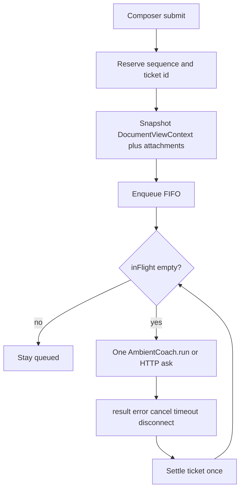

## Implementation contract and progress

Review corrections (take precedence over conflicting text below):

- Latest panel revision: merge Whiteboard into the Annotations submenu as one Ink toggle, separated from footnotes. Use tap-only action cycles (local boards: Draw/Ask; problems: Draw/Review/Lazy/Ask), document presets, and Reasoning Off/Low/Medium/High in divided sections. Ask is the default. Remove redundant standalone controls/preset strip.
- Latest toolbar revision supersedes the earlier above-sheet-dot fix: while the agent panel is open, hide and disable board chrome. Do not elevate the tray over chat or force it awake on closing; preserve the existing visibility/fold state. Header Agent toggle and panel handle remain close controls.
- September 19 user revision: use Astra Low for these implementation fixes. The right-hand utility tray, including fold/expand, must remain available in visible, idle-fade and visibility-hidden modes; hiding the drawing toolbar must not strip the utility tray down to the eye alone. Its existing idle/wake animation still applies. This supersedes the earlier request to hide fold in the visibility flow. Collapse points down and expand points up to match the bottom-anchored tray.
- Persist original request attachments in IndexedDB/app storage, referenced by stable IDs. Thumbnails are display assets, never substitutes for the original retry payload. Retain the exact prepared request for retry and report missing assets instead of silently substituting the current view.
- Freeze document identity, revision and camera/selection bounds before asynchronous capture. Validate that source again after capture; reject a changed source and preserve the question draft rather than attach mismatched pixels.
- Abort invalidates the attempt immediately, but queue draining must wait for transport release. WS cancellation requires acknowledgement or an isolated replacement connection; HTTP uses AbortController plus late-result guards. Compound ask/draw/review jobs must stop at cancellation boundaries.
- Working dots stop at the request terminal event. Word reveal is presentation of a completed response and does not imply a still-running request. Show genuine status/tool updates live and provider reasoning only after completion.
- Pure helper tests are necessary but insufficient: include focused integration tests at the request adapter and UI interaction boundary. Source scans supplement behavioral tests; they do not replace them.
- Notifications and undo/redo ship in separate commits and are verified separately.

Progress is recorded here with each implementation commit. Device-only checks remain explicitly pending until performed; passing unit tests does not imply Android acceptance.

- Plan corrections: committed in dae2afbe.
- Final hardening: exact outgoing Ask and compound-job bodies persist for Retry on both transports; images are deduplicated and omitted for non-vision models. Queued edits repack frozen quote/marks rather than replace matching text inside a quote. Preparation failure restores draft text/photos; failed selection capture keeps the selection. Cancellation/disposal races, explicit merge retention, hidden-panel execution and selection context normalization are covered or corrected. Native queued calls wait for invoke completion (no JS timeout releasing the queue early). Removed simulated review phase timers.

### Commit checkpoints

| Step | Commit |
| --- | --- |
| Queue / live status | `1362d7fd` |
| Frozen view / Android saves | `24c77b34` |
| Selection actions | `60784839` |
| Panel / vertical tray | `5ca45993` |
| Undo / redo | `dcc893c1` |
| Notifications | `f57ab233` |
| Request/draft hardening | `e99b901e` |
| Queued execution failures | `73efde90` |
| Tray visibility modes | `ab070e55` |
| Native capture permissions | `8386dca9` |

### Validation and remaining acceptance

- Production builds pass. Rust `cargo check --lib` and Android gallerysave `compileDebugKotlin` pass; this is not an installed APK acceptance test.
- Focused integration/regression run: 210 tests pass across queue/socket, Ask payload, selection draft/menu, capture, sheet drag, notifications, ink and PDF placement. Additional native prepared-request adapter test passes.
- Full-suite rerun September 19 including the latest panel revision: 3,317 passed, 1 failed, 7 skipped. The failure is `inkMarkCompositing.test.ts` (dwell-blot destination blit); that test, `rasterInk.ts`, and its `inkLab` implementation are unchanged from the starting commit. Do not treat the full suite as green. Use `NODE_OPTIONS=--no-experimental-webstorage` with this machine’s Node 26 so older jsdom tests get browser storage.
- Android reconnected on September 19. APK build and installed-device checks are in progress; the device's agent indicator is offline. Still required: Photos/Downloads/SAF save and permission revocation, share chooser, PDF/Markdown/EPUB visual crops, queued edits/abort/retry against a real model, populated-panel drag/keyboard/safe areas, tray animations/dot hit-testing, and idle-to-flick/undo latency measurements.
- Follow-up hardening: queued Review/Diagram/Lazy execution errors now reach the coordinator as failures, rather than looking completed after their UI error handler. FIFO continues after failures (5 coordinator tests pass).
- Device-found UI issue: the open sheet covered the agent dot because its ancestor chrome slot was at z-index 95 under the sheet at 99. Raising the child controls did not escape that stacking context. Raising the slot instead was confirmed with on-device hit-testing; permanent APK verification follows the tray changes. Closed sheet is hidden/inert and restores its height.
- Astra Low tray follow-up: fold/expand works in all three visibility modes, with collapse-down/expand-up SVGs and matching motion; hidden mode retains the utility tray independently of the drawing toolbar. The open agent keeps its close dot awake, and chrome elevation yields to dialogs. TypeScript and 64 targeted tests pass.
- Device-found native issue: capture commands were registered but absent from Tauri's permission allow-list, so the installed APK rejected them before MediaStore. Added an explicit main-window save/share/folder-picker permission and a regression check; rebuilding for installed-device verification. Capture adapter and permission tests pass (20 tests).
- Installed Android verification: full-feature debug APK built and updated without clearing app data. Photos and Downloads native saves produced public `Pictures/lc` and `Download/lc` files with `is_pending=0`; invalid folder rejected clearly; native folder picker opened and cancellation returned an empty URI; Android share chooser opened with a FileProvider PNG. A real SAF selection of `Pictures/lc` granted persisted access and successfully saved a PNG there, without changing the app's destination preference. Small synthetic test images were removed afterward. Permission revocation remains a manual check. On-device tray checks confirmed fold/expand in all three modes before the latest panel-hide revision.
- Default vision behavior: Send automatically snapshots the visible PDF/Markdown/EPUB viewport for a vision-capable Ask model, not the whole document. Plain problem Ask does not automatically export every page; Ink/Review/Lazy request marked-region crops (possibly multiple images), with code annotations rendered separately. This panel-layout revision does not silently change that capture scope.
- Latest Astra Low UI implementation: one Annotations popover owns Ink, footnotes, action, document presets and reasoning, with line separators. Action defaults to Ask; local/problem cycles differ as requested; reasoning cycles Off/Low/Medium/High. Options remain editable for queued sends while an earlier request runs. Removed the standalone Whiteboard, reasoning/action pills and preset strip. Board map controls become hidden, aria-hidden and inert during chat without changing visibility/fold state. Preserved Grok's later composer sizing and grid fold animation. Six behavioral options tests plus queue/tray regressions pass; production frontend build passes. Latest APK/device menu checks follow.
- Native Android sharing reports **share sheet opened**, not confirmation that another app saved it. The chooser API used here does not report that outcome. Selected-folder picker cancellation leaves the existing preference unchanged.
- A capture failure preserves the selection and reports an error; the optional explicit text-only continuation UI has not been added. Existing-image import remains import-to-board; capture destinations govern screenshot exports.
- Independent Astra High review remains recommended for request races, native URI permissions and PDF-scroll regressions before device sign-off.

### Per-step evidence
- Step 5b (notifications): implemented an ordered single-message presenter with leftward exits, no duplicate suppression/drop cap, faster backlog draining, dismissal and reduced motion. Validation: 3 timing/order tests pass; production build passes. Device animation acceptance remains pending.
- Step 5a (undo/redo): implemented one-frame history repaint coalescing and deferred dirty-region tile invalidation. Every semantic operation applies immediately; cached pixel fast paths remain bounded, stale fast-path paints are blocked during fallback replay, and worker rendering retains its existing yielding/cancellation boundaries. Validation: build and 131 ink/PDF tests pass, including 60 real strokes followed by 55 undos and 55 redos with one cache synchronization per burst. Device latency measurements remain pending.
- Step 4: implemented DOM/rAF sheet resizing with optional proximity snaps, header/viewport clamping, pointer-cancel handling, retained height/draft and fully hidden/inert closed sheet. Replaced the board lock with an online/offline agent toggle and added independent vertical-tray folding with reduced-motion-aware transitions; visibility restores the retained fold state. Validation: production build, 53 PDF contract tests and 2 sheet sizing/interaction tests pass (including no transcript render during drag). Device animation, keyboard and dot hit-testing remain pending.
- Step 3: implemented Screenshot and draft-only Ask Agent on both document selection layers. Crops use live camera/pane coordinates and the existing composited exporter; Ask retains selection text, original image, thumbnail and frozen source context without auto-send or save. Existing draft text is preserved; selection starts a new thread on Send. Validation: production build and 55 crop/PDF contract tests pass. Device selection/crop visual acceptance remains pending.
- Step 2: implemented Send-time document identity/view/text snapshots with post-capture validation, live-camera viewport images, full request storage plus display thumbnails, MediaStore Downloads and persisted SAF folder selection. Native failures no longer claim a browser download succeeded; share-opened/cancelled are distinct. Validation: 21 focused tests, production build, cargo check --lib and gallerysave compileDebugKotlin pass. Installed-device destination/cancellation acceptance remains pending.
- Step 1: implemented FIFO preparation reservations, transport-owned execution, Abort/Edit/Retry actions, retained attempt history, IndexedDB full request storage, interrupted restore, live status/dots and completion-only reasoning. TypeScript/build and 34 focused tests pass. Native Tauri invoke is not HTTP fetch and cannot accept AbortController: cancellation suppresses late results and waits for native completion before draining; WS uses its cancellation acknowledgement. Full device queue acceptance remains pending. Further steps add frozen document context to persisted requests.

# Agent, capture, and touch — expanded implementation plan

This is the implementation design for the proposed plan in `c:\Users\Amit\Desktop\• Proposed Plan.txt`. It maps each requirement onto the code that already exists, then records the naive implementations that would break this project and the matching-style path to take instead.

Treat reported failures as reproduction targets. Deliver **five separate, reviewable changes** in the order below. Do not combine them into one rewrite of `[app/src/Workspace.tsx](app/src/Workspace.tsx)` (~11k lines) or `[app/src/canvas/Board.tsx](app/src/canvas/Board.tsx)`.

Astra High’s second pass should review races, stale document context, Android URI handling, rendering invalidation, and PDF-scroll regression evidence before device sign-off.

## What already exists (do not rebuild)

- **FIFO send list** already lives in Workspace as `coachSendQueueRef` + `enqueueCoachSend` / `drainCoachSendQueue` / `coachRunGenRef`. The daemon still allows **one run per socket** (`[src/serve/ws.rs](src/serve/ws.rs)`); a second `run` is refused, not queued. The client must serialize.
- **WS identity and terminal events** already exist in `[app/src/api/coachSocket.ts](app/src/api/coachSocket.ts)`: `request_id`, `stage` / `tool_event` / `reasoning` / `result` / `error`, `settle()` once, `cancel(request_id)`. There is **no token stream**. Reply text arrives whole; `[useWordReveal](app/src/modes/AgentRichText.tsx)` is presentation only.
- **Transcript persist** already drops `pending` and shrinks photo `png` to `thumb` (`[app/src/modes/agentTranscript.ts](app/src/modes/agentTranscript.ts)`).
- **Board PNG** is a four-layer composite (paper → page DOM/PDF → scene → raster ink), never html2canvas of the window (`[exportBoardBlob` / `exportSceneFrameBlob](app/src/canvas/Board.tsx)`). Chrome is excluded because it is not in those layers.
- **Android Photos** already uses MediaStore `Pictures/lc` (`[GallerySavePlugin.kt](app/src-tauri/plugins/gallerysave/android/src/main/java/GallerySavePlugin.kt)`). Downloads and Folder still `fs::write` and can land in `app_data_dir/captures`.
- **Selection menus** have Mark / Copy / Google / Annotate (`[DocSelectionLayer.tsx](app/src/modes/DocSelectionLayer.tsx)`) and scene rotate/flip/delete (`[SceneSelectionOverlay.tsx](app/src/canvas/SceneSelectionOverlay.tsx)`). No Screenshot / Ask Agent. `pendingQuoteRef` / `setCoachQuoteSeed` in Workspace are dead.
- **PDF scroll contract** is locked by negative source-scan tests in `[Board.excalidraw.test.mjs](app/src/canvas/Board.excalidraw.test.mjs)`: no ancestor CSS on glyph spans, no `offsetHeight` on the camera transform path, intersecting-host classes only (`[pdfFilm.ts](app/src/modes/pdfFilm.ts)`).

UI says Agent; internals stay `coach*` (`coachSendQueue`, `askAgent`, `coachRef`) unless a file is already `agent*`.

## Style simulations (how not to break the project)

Each workstream was simulated against this repo’s habits: extract a **pure module next to existing helpers**, keep React in the current components, drive **Vitest beside the module**, never mount Workspace, and add **negative source-scan tests** in `*.test.mjs` whenever CSS or Board pan/undo comments move.

### Simulation A — put coordination in React / global busy

Would fail: `drainCoachSendQueue` already no-ops while `busyRef` still holds `"asking…"` after `setBusy(null)` because `busyRef.current = busy` only updates on the next render. Pad load (`"opening document…"`) would keep blocking the agent queue. Two idle Enters can both `await prepareCoachSend` (up to 15s export) before either sets busy; the daemon then busy-errors the second.

**Chosen style:** new pure coordinator module `[app/src/modes/coachSendCoordinator.ts](app/src/modes/coachSendCoordinator.ts)` (same neighborhood as `[coachContext.ts](app/src/modes/coachContext.ts)`, `[coachMarkContext.ts](app/src/modes/coachMarkContext.ts)`). Workspace holds **one instance per tab** in a ref. Own `inFlight` / `editBarrier` — do not use workspace `busy` as the queue gate. Clear `inFlight` **synchronously** before drain (same pattern as `busyRef.current = null` in `openWebPage` at Workspace ~5452). Reserve sequence **before** any `await`. Keep `setBusy("asking…")` as UI copy only.

### Simulation B — new provider protocol / fake streaming

Would fail: the plan forbids protocol replacement. Invented “thinking” text would lie. Token deltas do not exist on `routeRunFrame`.

**Chosen style:** keep WS `run` / HTTP `lc_coach_ask`. Live status = existing `onProcess` / `onReasoning` into `processEvents` (already rendered by `[ProcessBlock](app/src/modes/ProcessBlock.tsx)`). Local `.` / `..` / `...` dots are a **memoized child with its own timer**, not transcript state. Keep `useWordReveal` for the atomic reply; if a future delta field appears, batch into rAF in that same helper. Reduced motion: static indicator (already the pattern in AgentRichText).

### Simulation C — html2canvas / live context at drain / new RPC for Ask

Would fail: viewport grabs include toolbar and the agent sheet. Reading `pdfNavRef` at drain would attach the page the student navigated to after Send. A new Ask RPC would duplicate `[askAgent](app/src/Workspace.tsx)`.

**Chosen style:** snapshot DocumentViewContext in `prepareCoachSend` **at submit**, store it on the ticket. Send through existing `page_text` / `highlight` / `images` / `document_hash` / `page`. Screenshots via `exportSceneFrameBlob` / `exportViewThumb` (ink in, chrome out). Ask Agent is **draft-only**: open panel, attach thumb, do not call `sendCoachChat`.

### Simulation D — React height every pointer sample / measure the document while dragging

Would fail: `setSheetOffset` already re-renders the whole panel every move (`[AgentSidePanel.tsx](app/src/modes/AgentSidePanel.tsx)` ~1021). Writing `--lc-agent-sheet` as a document-wide CSS var every frame, or calling `offsetHeight` on the page slot, reintroduces the 18k-glyph hitch the PDF work just removed.

**Chosen style:** pointer capture + rAF writes **on the sheet DOM node** (`transform` / height). Commit React height/open on pointerup. Toolbar fade stays a CSS var written from the gesture, not through Board React. Do not touch `[placeContentSlotAt](app/src/canvas/Board.tsx)` / `[syncMarksSlotFrom](app/src/canvas/Board.tsx)`.

### Simulation E — fold = hide toolbar = leave annotate / measure `.lc-board` width

Would fail: `annotateCode` is scroll vs ink, not island visibility (`[toggleAnnotate](app/src/canvas/Board.tsx)` ~2760). Measuring the first `.lc-board` in a split already flipped the island sideways from the wrong pane (`[toolbarWindowIsNarrow](app/src/util/toolbarLayout.ts)`).

**Chosen style:** third independent flag `folded` on toolbar layout prefs. Fold does not change `annotateCode`, selected tool, or `mapChromeHidden`. Axis math stays window-based. Animate with transform/opacity (~220 ms), interruptible; reduced motion jumps.

### Simulation F — Android `fs::write` / treat content URI as a path / `navigator.share`

Would fail: Downloads already toast “Saved to Downloads” while the file sits in app-private storage (`[capture_save.rs](app/src-tauri/src/capture_save.rs)` last-resort `app_data_dir/captures`). Web Share is undefined in the cleartext WebView. A POSIX path cannot open a SAF tree URI.

**Chosen style:** extend **Kotlin** MediaStore Downloads + SAF tree; JS keeps `[saveCaptureToDevice](app/src/util/capturePrefs.ts)`. Share stays FileProvider cache (cancellation ≠ success). Desktop filesystem behavior unchanged.

### Simulation G — unlimited undo snapshots / `instantReplayOnUndo() === true` / drop all tiles

Would fail: dense Exam pages already froze on full remesh (`[liveHost.ts](app/src/canvas/inkLab/liveHost.ts)`). Emptying the tile cache on undo flashed holes in the lower half (`[inkTiles.ts` `setOps](app/src/canvas/inkTiles.ts)`). Unlimited bitmaps would OOM the pad.

**Chosen style:** keep semantic book + 40-slot patch cap. Apply each history op once and move the cursor immediately. Coalesce paints to the latest requested cursor via existing `replayGenRef`. Yield with existing `[yieldToInput](app/src/util/cameraBusy.ts)`. Invalidate dirty AABB only. Do not call `forgetPixelHistory` inside undo/redo.

---

## Change 1 — Agent request lifecycle and queue

**Goal:** one coordinator per Workspace tab; FIFO; one running request; late events ignored; message actions Abort / Edit / Retry.

### Coordinator contract

New module `coachSendCoordinator.ts` (pure, fully unit-tested). Workspace becomes a thin adapter.

Ticket fields (frozen at submit, before `await prepareCoachSend`):

- `messageId`, `threadId`, `sequence`, `state`: `preparing | queued | running | completed | failed | cancelled | interrupted`
- captured `DocumentViewContext` + attachment refs (thumbs, not 1568px `png` in persist)
- `prompt`, flags, `replyTo`, `userMessageId`

Rules:

- Reserve `sequence` synchronously on Send. A later prepare cannot overtake an earlier one even if export finishes first.
- One `inFlight` per workspace. Nested ask+draw+lazy stays **one ticket** (today’s `coachSendDepthRef`).
- Drain after enqueue, after prepare, and after every terminal event. Terminal: completion, failure, disconnect, timeout, cancel. `settle()` exactly once (mirror `[coachSocket.settle](app/src/api/coachSocket.ts)`).
- Ignore frames whose `request_id` / ticket id is cancelled or superseded (`coachRunGenRef` becomes per-ticket generation, not a global bump that drops the whole queue).
- History for the model: `[buildConversationContext](app/src/modes/coachContext.ts)` must skip `queued`, `preparing`, superseded attempts, and future tickets. Include completed preceding turns of that thread only. Extend the existing filter (today it only drops `pending`).
- **Preserve Ctrl/Cmd+Enter merge** as an *explicit* interrupt (it already exists). Default Enter is FIFO and must not cancel unrelated work. Retry enqueues; it does not `cancelAll`.

Abort / Edit / Retry (long-press menu in `[AgentSidePanel.tsx](app/src/modes/AgentSidePanel.tsx)` ~2141, plus keyboard):

- **Running → Abort:** `coachRef.cancel(request_id)` (not `cancelAll`). Keep partial assistant text marked cancelled. Drain continues.
- **Queued → Abort:** remove ticket, mark bubble cancelled.
- **Queued → Edit:** edit barrier — current run continues; no later queued ticket starts. Save keeps sequence; Cancel restores text. Closing the composer without save = Cancel. Aborting the item being edited releases the barrier.
- **Completed / failed / cancelled → Retry:** new attempt, same question + captured context, new ticket id, joins FIFO. Keep prior attempts; show newest by default (attempt chip or stacked history under the bubble).

HTTP path: add `AbortController` to `[client.ask](app/src/api/client.ts)` so Abort is not WS-only. Gen-drop remains the late-result guard.

### Persist after restart

Extend `persistableAgentMessages` / `restoreAgentMessages`:

- Persist ticket metadata + attachment **thumbs** + context summary (page ids, truncation flags, not full PNGs).
- Unfinished `running` / `preparing` restore as `interrupted` with Resume/Retry — **do not auto-resend**.
- Queued tickets restore as interrupted as well (the socket is gone).
- Keep dropping empty pending shells that have no ticket metadata (old pads).

### Live feedback (ships with this change because it hangs off the same pending turn)

- Drive `ProcessBlock` from genuine stage/tool frames only.
- New tiny `ThinkingDots` (local state, 400 ms, `aria-hidden`) beside the active assistant bubble, including while word-reveal runs. `memo` so dots do not rerender the transcript list.
- After the attempt finishes, show provider reasoning via existing `ReasoningBlock` / `message.reasoning`.
- Stop dots and process `running` on every terminal state. Reduced motion: static “Working”.
- Transcript scroll: if the user is not pinned to the bottom, do not force-follow. Batch any future streamed text on rAF inside `useWordReveal` (interval → rAF). Existing 50 ms interval is acceptable until deltas exist.

### Files

- Add: `[app/src/modes/coachSendCoordinator.ts](app/src/modes/coachSendCoordinator.ts)`, `coachSendCoordinator.test.ts`
- Touch: Workspace send/drain/ask (`sendCoachChat` ~7011, `prepareCoachSend` ~6552, `askAgent` ~6315, `runCoachJob` ~5761) — **move logic out**, leave wiring
- Touch: `[AgentSidePanel.tsx](app/src/modes/AgentSidePanel.tsx)` menu + dots, `[agentTranscript.ts](app/src/modes/agentTranscript.ts)`, `[coachContext.ts](app/src/modes/coachContext.ts)`, `[client.ts](app/src/api/client.ts)` abort, `[padSync.test.ts](app/src/util/padSync.test.ts)` restore interrupted
- Do not change daemon queue policy.

### Tests (must not mount Workspace)

Queue: prepare finishing out of order; completion/enqueue race; duplicate terminal; late cancelled frames; disconnect/timeout; two idle submits; drain after sync `inFlight = null`; edit barrier while head completes; Save/Cancel/Abort; retry does not abort unrelated; merge still explicit.

Context history: queued/future excluded; superseded excluded; thread-scoped.

---

## Change 2 — Document context and capture/save

**Goal:** freeze what the student was looking at when they pressed Send; make Android destinations actually visible.

### DocumentViewContext

New `[app/src/modes/documentView.ts](app/src/modes/documentView.ts)`, captured from the **originating Workspace pane** (each tab already owns its board/marks/agent; split partners must not leak — Workspace comment at ~586–590).

Snapshot at Send (before async export):

- Document id/hash, revision, format (`pdf` / `epub` / `markdown` / `web` / whiteboard), title
- Active pane / split role
- PDF: `[pdfFilm` intersecting pages](app/src/modes/pdfFilm.ts) (not only `pdfNav.current`), plus extracted text for those pages via `[pageTextForAsk](app/src/util/docExtract.ts)` / `extractedPagesFor`
- EPUB: current chapter href/text range visible in the reader
- Markdown: visible rendered range (intersecting content hosts), corresponding source/text
- Viewport/selection bounds in scene coords
- Optional image: `exportViewThumb` or selection frame, ink included
- Truncation flags when text or image hit existing budgets (`[PAD_ASK_CLIP_CHARS](app/src/modes/coachMarkContext.ts)` 12k, `[CAPTURE_MAX_EDGE](app/src/canvas/capture.ts)` 1600, thumb 640 / 2 MB)

Navigate after Send must not change a queued ticket’s context.

Outgoing payload still uses existing Ask fields. Tests must assert `**askPayload**` (hash, page(s), `page_text`, `highlight`, `images` length/presence), not the chat thumbnail. If vision is off, omit images and send text + an explicit limitation string. Scanned page with empty extract and no vision: send a limitation, not an empty view.

Reuse `[assembleAskPrompt](app/src/modes/coachMarkContext.ts)` / mark packing. Do not replace footnotes with screenshots.

BoardHandle: add `captureDocumentView(): DocumentViewSnapshot` next to `exportViewThumb` — read intersecting pages, camera box, title; do not remesh or `offsetHeight` the film.

### Android destinations

Keep `[saveCaptureToDevice](app/src/util/capturePrefs.ts)` and `[CaptureSaveResult](app/src/util/capturePrefs.ts)`. Extend the native side:

- **Photos:** already MediaStore Images `Pictures/lc` — keep. Unique `DISPLAY_NAME` (timestamp) so captures do not overwrite.
- **Downloads:** new MediaStore Downloads (`DIRECTORY_DOWNLOADS + "/lc"` or Downloads collection) in the Kotlin plugin; `[save_png_bytes](app/src-tauri/src/capture_save.rs)` must branch Downloads like Photos on Android. **Do not** fall through to `app_data_dir/captures` and still toast “Downloads”.
- **Folder:** Android system tree picker (`ACTION_OPEN_DOCUMENT_TREE`), persist URI permission, write via `DocumentFile`. Store the tree URI string in the existing folder pref; **never** `PathBuf::from(content://…)`. Desktop keeps typed path + `~` expand.
- **Share:** keep FileProvider cache + `FLAG_GRANT_READ_URI_PERMISSION`. Chooser cancel is `outcome: "failed"` (or a new `"cancelled"`), not `"shared"`. Do not also insert into Photos unless the user asked.
- Desktop Photos/Downloads/folder filesystem behavior stays.

Success toast only after the write returns a URI/path. Errors: permission loss, cancelled picker, unavailable dest, failed write — actionable copy. Audit **generated screenshots and existing-image exports** through the same function.

Settings copy today says folder is “Desktop app only” (`[SettingsModal.tsx](app/src/components/SettingsModal.tsx)` ~1816). Update that once SAF works.

### Files

- Add: `documentView.ts` + tests
- Touch: `prepareCoachSend`, `askAgent` payload, BoardHandle + Board `captureDocumentView`
- Touch: `GallerySavePlugin.kt`, `capture_save.rs`, `capturePrefs.ts` / tests, Settings folder picker button
- Do not rewrite `exportBoardBlob` / `compositePageLayers`

### Tests

Context frozen vs later navigation; split panes; pdf/md/epub; missing text; non-vision omits images; truncation flags; save success/fail/cancel mappings (pure JS + Rust dest parse; Kotlin paths documented for device).

---

## Change 3 — Selection-to-chat workflow

Depends on changes 1–2 (draft tickets + shared capture).

### Selection menu

Add **Screenshot** and **Ask Agent** to the existing drag-selection sheet in `[DocSelectionLayer.tsx](app/src/modes/DocSelectionLayer.tsx)` (~2795). Optionally the same two actions on `[SceneSelectionOverlay.tsx](app/src/canvas/SceneSelectionOverlay.tsx)` for shape selections (same `exportSceneFrameBlob` path).

- Freeze selection rect + source identity **before** render (current `highlightBox()` / scene bounds). Overlay chrome must not enter the PNG.
- **Screenshot:** `exportSceneFrameBlob` → `reportCapture` / `saveCaptureToDevice` using current destination prefs. Ink in, toolbars/agent/other panes out.
- **Ask Agent:** new thread **draft**, attach selection PNG as thumb (app storage / transcript thumb, **not** gallery), retain selected text as `pageQuote` + DocumentViewContext, `onOpenChange(true)`, focus composer. **Do not send.** This is the revival of dead `pendingQuoteRef` / `setCoachQuoteSeed`.
- Capture failure: toast, keep marquee and any typed draft. If usable text exists, offer an explicit text-only continue (composer chip), never silent empty vision.

Store draft images the same way composer photos do (`[photoAttach.ts](app/src/util/photoAttach.ts)` 320px thumb persist, 1568px only if later Send needs vision).

### Files

- Touch: DocSelectionLayer actions + Workspace handlers (~8041), SceneSelectionOverlay, AgentSidePanel composer focus/draft, `pendingQuoteRef` wiring
- Reuse: `exportSceneFrameBlob`, `captureImage` shrink, coordinator enqueue only when the student later hits Send

### Tests

Bounds frozen; draft-first (no `sendCoachChat`); failure preserves selection; text-only fallback flag; chrome selectors absent from export path (source-scan if needed).

---

## Change 4 — Panel dragging, agent-dot control, toolbar folding

Depends on change 1 only in that hiding the panel must not abort/pause the coordinator.

### Agent dot owns visibility

Replace the lock control in the Board view stack (`[Board.tsx](app/src/canvas/Board.tsx)` ~10080, `[LockIcon](app/src/canvas/Board.tsx)` ~10510) with the existing green/red LLM dot already on the header Agent chip (`[Workspace.tsx](app/src/Workspace.tsx)` ~9743, `.lc-agent-live-dot`).

- Tap toggles panel whether `llmLink` is online or offline.
- Hidden: no peek strip, no bottom handle, no invisible hit target. Remove `COACH_SHEET_PEEK_PX` park path for the hidden state.
- Preserve conversation, composer draft, last **nonzero** height.
- Ignore `[agentSheetLockPref](app/src/util/agentSheetLockPref.ts)`; stop writing `whiteboard.agent.sheetLock.v1`. Leave the loader as a no-op so old prefs do not re-lock.

### Responsive height drag

Mobile sheet becomes a **height** gesture, not only open/peek translate.

- Pointer capture on the handle (already at ~1001). Coalesce moves to rAF; write height/transform on the **shell element**.
- Isolate message list from height: clip/resize the shell; relayout messages **on release**.
- Snap default **on**, setting to disable. Stops: current default height (`min(58vh, 520px)` / tablet `min(64vh, 600px)`) plus 25/50/75% of usable height below the header. Deduplicate coincident stops. Snap only if release is within **24 CSS px**; else keep free height.
- Clamp to header, `--lc-safe-*`, and visual viewport. Keyboard uses existing `[--lc-keyboard-inset](app/src/util/safeArea.ts)` to **temporarily** clamp without overwriting saved height. Parked/hidden sheet stays `bottom: 0` (do not lift by last keyboard height — already the CSS rule at ~13926).
- Dragging does not dismiss; the dot does.
- Desktop side panel stays width-based; do not apply vertical sheet drag there.
- Transcript scroll anchor during drag and during streaming (change 1).

New prefs: `whiteboard.agent.sheetHeight.v1`, `whiteboard.agent.sheetSnap.v1` (default true). Follow existing `whiteboard.agent.*.v1` + coach legacy pattern only if a key already existed.

### Foldable vertical toolbar

Independent of `annotateCode` (mode), `mapChromeHidden` (visibility), and row/column axis.

- Fold control at the **top of the expanded column** (and available when the island is a column).
- Fold → one expandable icon; selected tool and annotation mode unchanged.
- ~220 ms transform/opacity, interruptible; no per-frame document measurements; do not call `syncMarksSlotFrom(..., true)` or measure paper height.
- Hidden (`mapChromeHidden`) hides both expanded controls and the folded icon; only the existing visibility restore (eye / annotate toggle) remains. Restore animates back to last folded/expanded.
- Folded/hidden controls: `visibility` + `inert` / `aria-hidden` so they cannot take pointer or keyboard focus.
- Persist `folded` on `[ToolbarLayout](app/src/util/toolbarLayout.ts)` without changing window-width axis math.
- Reduced motion: instant.

### Files

- Touch: AgentSidePanel drag/open, Workspace header dot, Board lock removal, styles for sheet height and `.lc-toolbar` fold, `toolbarLayout.ts` + tests, `safeArea` unchanged
- Add: `agentSheetHeight.ts` (or fold into a small `agentSheetPrefs.ts`) + tests for snap/clamp
- Source-scan: no new ancestor glyph CSS; no height-on-pan

### Tests

Snap/clamp math; hidden has no hit target (class/style contract); keyboard clamp does not persist; toolbar folded vs hidden vs annotate; reduced motion; `toolbarLayout.test.ts` hysteresis still window-based.

---

## Change 5 — Undo/redo performance and notification sequencing

Independent of 1–4 except both must stay off the PDF style-recalc path.

### Notifications

Replace concurrent stack + identical-text refresh + cap-4 eviction in `[notifications.ts](app/src/util/notifications.ts)`.

Keep the **call site API** `showNotification(text, duration)` so Board / App / ModeIndicator do not change.

Presenter rules:

- Every event is a queue entry. Do not reuse id for identical text; do not drop oldest at 4.
- Show **one** at a time. Current exits left, then next enters (`[NotificationStack](app/src/components/NotificationStack.tsx)` already exits `x: -300`).
- Dwell: requested duration, min 1.4 s (already `Math.max(1400, duration)`).
- 2–4 waiting: remaining dwell ≤ 900 ms; 5+: ≤ 450 ms.
- Transition 220 ms normal, 120 ms backlog. Reduced motion: order preserved, no slide.
- Dismiss (×) advances immediately.
- Announce each message **once** via the existing `aria-live="polite"` region (do not also toast through App’s second overlay).

Do **not** merge `[CaptureFeedback](app/src/canvas/CaptureFeedback.tsx)` (assertive save pills) or `[SplitFocusToast](app/src/canvas/SplitFocusToast.tsx)`.

### Undo/redo

Profile on device first (baseline vs after). Code already has:

- Semantic book `[inkPageCache.undoOnce](app/src/canvas/inkPageCache.ts)`
- 40-slot bitmap patches `[INK_PIXEL_HISTORY_CAP](app/src/canvas/inkLab/history.ts)`
- `replayGenRef` cancel of obsolete presents
- Dirty-AABB `setOps`
- `instantReplayOnUndo() === false`
- `yieldToInput` during some presents

Changes inside `[WhiteboardInkLab.tsx](app/src/canvas/WhiteboardInkLab.tsx)` undo/redo (~1120–1193):

- After `undoOnce`/`redoOnce`, the logical cursor is already updated — keep that **before** paint.
- If a second undo arrives while `presentCommitted` is running, bump `replayGen` (already) and retarget to the **latest** cursor instead of queuing N full replays.
- When past the patch cache, rebuild **intersecting dirty tiles** only (already the `setOps` intent); yield between bounded replay units so further taps stay responsive.
- Do not raise the 40 cap to “solve” stalls. Do not `forgetPixelHistory` in undo/redo. Preserve add/erase/clear, redo-branch truncation (`dropRedoStacks` on new stroke), document switch, `[inkPageStore](app/src/util/inkPageStore.ts)` persistence.
- Background persist may coalesce; the **final** history cursor must still flush.

### Files

- Touch: `notifications.ts` + new `notifications.test.ts`, NotificationStack timing
- Touch: WhiteboardInkLab undo coalescing, maybe `inkTiles` replay budget; tests in `history.test.ts`, `inkTiles.test.ts`, `liveHost.test.ts`, `Board.excalidraw.test.mjs`

### Tests

Notification order, backlog timing with fake timers, dismiss skip, reduced-motion no slide, live-region once.

Undo: beyond 40 patches, mixed erase, N rapid undos collapse to one present of the latest state, gen cancel, persistence of final cursor.

---

## Cross-cutting regression wall (every change)

Do not reintroduce:

- Ancestor selectors on `.lc-pdf-text span` / `.lc-doc-selectable *` / markdown `pre` under `.lc-board-reading` or `.lc-board-annotating`
- `offsetHeight` on `placeContentSlotAt` / marks slot during camera translation
- `instantReplayOnUndo() === true`
- Looping `setPointerCapture`
- Mixing keyboard into `--lc-safe-bottom`
- Auto-resend of interrupted tickets
- Gallery insert as a side effect of Ask Agent draft or Share

If a change edits `styles.css` near document/toolbar/agent rules, add or extend a **negative** `expect(css).not.toMatch(...)` in `[Board.excalidraw.test.mjs](app/src/canvas/Board.excalidraw.test.mjs)`.

---

## Validation

After each change: `npm run build` in `app/` (tsc + vite) **and** the vitest files that cover the edit. `*.test.ts` is inside tsc; source-scan that `readFileSync`s Board belongs in `*.test.mjs`.

Device (Magic Note Pad, release-like APK), baseline vs after:

- Ten queued messages each processed once, including edit barrier and cancel
- Saved PNGs reopen from Photos / Downloads / SAF folder / share (share cancel is not success)
- Visible PDF, Markdown, EPUB questions keep the Send-time context after navigation
- Dragging a populated streaming panel does not rerender every message per pointer sample
- Rapid undo/redo past the patch cache does not progressive-stall; actions remain
- Target: <100 ms input-to-visible at p95; investigate feature-owned main-thread tasks >50 ms
- Recheck cold-idle PDF flicks and annotation/scroll toggle (no whole-document style recalc)

Handoff per change: diff, test results, device notes, unresolved issues. No provider protocol replacement. Extend transport fields only if `request_id` or document context cannot ride the existing Ask payload — currently they can.
