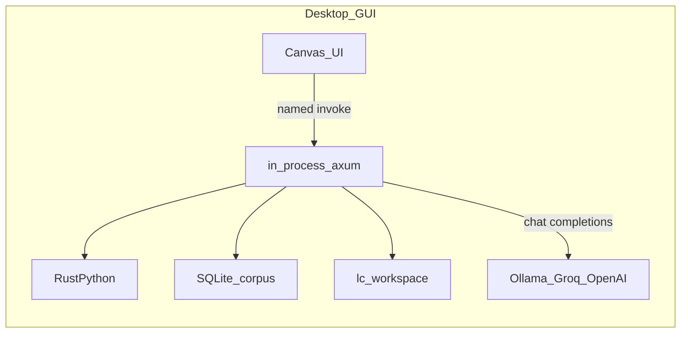
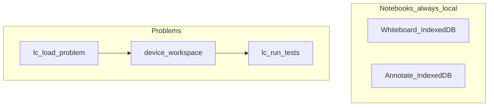

# Architecture

Internals. If you just want to install and use the app, read the
[README](README.md) instead.

---

## The pieces

| Name | What it is | Where |
| --- | --- | --- |
| Root Rust crate | `whiteboard`, the whole harness: index, tests, serve, TUI, notebook DB | [`Cargo.toml`](Cargo.toml) |
| CLI binary | `lc`, from `cargo install --path .` | [`src/`](src/) |
| GUI crate | `whiteboard-gui` | [`app/src-tauri/Cargo.toml`](app/src-tauri/Cargo.toml) |
| GUI native lib | `whiteboard_lib`, which Android links as `libwhiteboard_lib.so` | same |
| Client | React + Vite | [`app/src/`](app/src/) |
| Android id | `dev.lc.whiteboard`, shared by both build flavors | |

Feature `leetcode` is the only compile-time split. On by default. Off gives the
Whiteboard-only build.

---

## There is no daemon

The desktop window is the router. Tauri holds axum in-process, so there is no
TCP bind, no `127.0.0.1:7878`, and no separate `lc serve` step. Tests run on
RustPython rather than a `python` executable. The APK works the same way.

```
JSON corpora ─whiteboard index──▶ SQLite (problems.db)
                              │
                        whiteboard load <id>
                              ▼
        ~/lc-workspace/[<dataset>/]<task_id>/
        ├── solution.py
        ├── board.json          ← whiteboard, when kept
        ├── run_tests.py
        └── .lc/meta.json       ← cases / entry point (no reference solution)
                              │
                        whiteboard test · whiteboard ask · GUI
```



Three layers that move independently:

| Layer | What | Where | "Anywhere" means |
| --- | --- | --- | --- |
| Canvas UI | Ink, footnotes, tabs | On the device | Already there |
| Agent / LLM | Chat HTTP | Same process as the GUI, out to the model URL | The model URL must be reachable from *this* device |
| Harness | Corpus, `solution.py`, RustPython tests, document index | Inside the GUI process | Workspaces and `problems.db` on this machine |

The same React client runs on desktop, on Android, and under Vite. Vite in a
browser (`npm run dev`) has no Tauri behind it and is not a supported path. To
drive the desktop window from a tablet, use spacedesk. That sends pixels, not a
second instance.

---

## Notebooks vs problems



| Surface | Offline | Sync |
| --- | --- | --- |
| Whiteboard / Annotate | Full. The working copy is IndexedDB on the device. | Dual-writes to `pads.db` and `pad-blobs/`. A tombstone hides a notebook on every device sharing that store; snapshots and PDF bytes stay with it. The sidecar `.lc-ink.json` is a backup, not the sync path. |
| Problems | Empty until Settings → Datasets → Install. Tests run in-process. Pass/fail lives in `session.json` and survives Remove plus reinstall. | Anything sharing the workspace dir shares the state. On reconnect, Personalise `offlineMerge` (ask / prefer-local / prefer-server) decides which board wins. |

The device IndexedDB is the working copy. `pads.db` is a redundant historical
one. A missing or corrupt local row must never delete the on-disk copy. Delete
is hold-to-confirm and only tombstones the live list. Restore comes from the
archive or from the 2h / 24h / 7d snapshots.

Personalise (handedness, theme, capture folder, and so on) is a per-device blob.

### A note on the word "pad"

It means two unrelated things in this repo, and only one of them was renamed.

**The build flavor.** What used to be called "pads-only" is now
**Whiteboard-only**. Scripts and npm targets are renamed. The old names still
work as forwarding wrappers.

**The notebook library.** `pads.db`, `pad-blobs/`, `/pads/…`,
[`src/pads.rs`](src/pads.rs), `PadKind`. Not renamed. These name data on disk in
every existing install. Changing them is a runtime migration rather than a
rename, and getting it wrong opens the app to an empty library.

"Scratchpad" is a third thing again, the blank-notebook mode as opposed to
annotating a PDF. Also unchanged.

---

## The agent

Redaction, diagrams as programs rather than pictures, the approach-commitment
model, and the frame contract live under [`src/llm/coach/`](src/llm/coach/).

The reference solution shipped with a corpus never reaches a prompt. Review runs
perceive → claim → verdict inside the process, and answers over Tauri events
(`lc-coach-frame`) so each stage appears as it happens.

HTTP routes stay `/coach/*`. Config keys stay `coach.*` and
`llm.modes.<ambient|review|bridge|viz|planner>`. The rename to "Agent" is
user-facing only. `/workspace/:id/agent` is a different thing: the chat
transcript file.

Feature flags:
`coach.<ws_runs|process_events_ui|approach_commitment|planner_enabled|draw_review_enabled>`.

---

## Building

| Change | `Cargo.lock` | `app/package-lock.json` | Rebuild? |
| --- | --- | --- | --- |
| Docs | no | no | no |
| `package.json` **scripts**, `.cmd` / `.sh` / `.mjs` | no | no, scripts are not in the lockfile | no, until you want a new APK |
| `.github/workflows/*.yml` | no | no | CI compiles on next push |
| Renaming the `whiteboard` crate | yes | no | everything, plus `package = "whiteboard"` in the GUI crate |

The Practice APK is aarch64-only, because rustpython 0.5 does not compile for
32-bit Android. Whiteboard-only has no such limit and builds universal.

Both flavors write to the same path:

```
app/src-tauri/gen/android/app/build/outputs/apk/universal/debug/app-universal-debug.apk
```

or `.../apk/arm64/debug/app-arm64-debug.apk` when the build was pinned to one
target. Nothing under `gen/` is in git. The parts worth keeping live in
`app/src-tauri/android-overlay/`.

CI pins NDK **r26d**. Local tablet builds have been on **29.0.13846066**. Both
work. If a build fails in one place and not the other, check that first.

### Auditing a corpus

```bash
cargo run --release --bin audit_tests -- --dataset kodcode --out audit-kodcode.jsonl
cargo run --release --bin audit_tests -- --dataset kodcode --out audit-kodcode.jsonl --resume
```

One JSON object per problem whose tests RustPython cannot execute. It flushes
every 25 rows, and `--resume` continues after a crash.

Dataset adapters live in [`src/datasets/`](src/datasets/). After changing one,
run `whiteboard index --dataset <slug> --rebuild`.

---

## The stripped sibling branch

[`claude/strip-harness-ask-tauri-jeebbu`](https://github.com/amittenak47/lc-gui-tui/tree/claude/strip-harness-ask-tauri-jeebbu)
is a different product, not a branch waiting to merge. No corpus, no RustPython
runner, no problem browser. Tauri depends on the crate with
`default-features = false`, so the agent is in the APK and axum is not. Ask
talks straight to `llm.local.base_url`.

Staged Review does not exist there. Ask is one model call. Draw/Viz still has a
tool loop for diagrams, which is not perceive → claim → verdict.

This tree gates Practice behind `VITE_FEATURE_LEETCODE` and the Cargo `leetcode`
feature instead of forking. Do not merge the two. Main stays the harness.

---

## Not done yet

- `lc sync` hub, for notebooks across devices.
- The TUI catch-up work listed under [Upcoming](README.md#upcoming).
