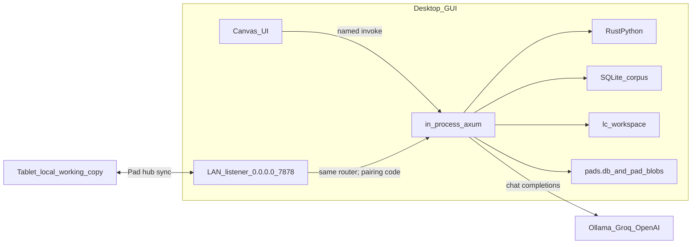
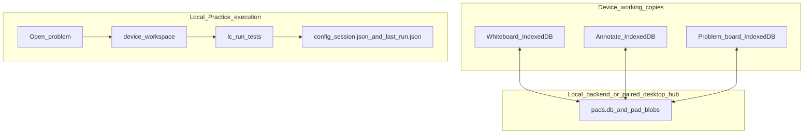

# Pen Island architecture

Internals. If you just want to install and use the app, read the
[README](README.md) instead.

---

## The pieces

| Name | What it is | Where |
| --- | --- | --- |
| Root Rust crate | `whiteboard`, the shared engine: corpus index, Practice tests, router, notebook DB | [`Cargo.toml`](Cargo.toml) |
| CLI binary | `lc`, maintenance-only: `index`, `datasets`, `config`; from `cargo install --path .` | [`src/`](src/) |
| GUI crate | `whiteboard-gui` | [`app/src-tauri/Cargo.toml`](app/src-tauri/Cargo.toml) |
| GUI native lib | `whiteboard_lib`, which Android links as `libwhiteboard_lib.so` | same |
| Client | React + Vite | [`app/src/`](app/src/) |
| Android id | `dev.lc.whiteboard`, shared by both build flavors | |

The Practice split uses Cargo feature `leetcode` (on by default) together with
`VITE_FEATURE_LEETCODE`. Disabling both gives the Whiteboard-only build.

The five native plugins are `gallerysave` (capture saves), `gestureguard`
(writing gesture protection), `inkrecognition` (ML Kit), `livewebview` (native
pages and capture), and `voicedictation`. They live under
[`app/src-tauri/plugins/`](app/src-tauri/plugins/).

## Names you'll see in the code

Pen Island is the public product name. The executable `lc`, Rust crates
`whiteboard` / `whiteboard-gui`, native library `whiteboard_lib`, app id
`dev.lc.whiteboard`, plugin packages, CSS `lc-` classes and `lc_*` commands stay
stable. Storage keys and databases (`whiteboard.*`, `lc`, `pads.db`, `pad-blobs`),
Practice directories (`~/lc-workspace`, `.lc/`), and backup formats keep their
existing names so data and imports continue to work. Whiteboard also remains
the mode and build-flavor name. The GitHub repository was renamed from
`lc-gui-tui` to `pen-island`; GitHub redirects the old repository and download
URLs, so builds that still fetch problem sets from the old address keep working.

The `lc` CLI handles only corpus indexing, dataset inspection and configuration;
bare `lc` prints help. The separate `audit_tests` binary audits corpus tests.
Problem editing, tests and Agent interactions run through the app.

---

## There is no daemon

Tauri dispatches local app commands through axum in-process. Tests run on
RustPython rather than a `python` executable, on desktop and Android alike.
There is no separate `lc serve` CLI daemon.

Desktop startup also serves the shared router on `0.0.0.0`, at configured
`serve.port` (default **7878**), with a persisted six-digit pairing code. Both
Practice and Whiteboard-only host this LAN Pad hub. Its PC URL and code appear
under **Settings → Personalize → Storage → Pad hub**; the tablet connects from
the same section. Android keeps its own embedded router and does not start this
desktop listener. Model calls and corpus downloads use network services.

```
JSON corpora ──lc index / GUI install──▶ SQLite (problems.db)
                                       │
                        Practice open: /problems/:id/load
                                       ▼
        ~/lc-workspace/[<dataset>/]<task_id>/
        ├── solution.py
        ├── board.json          ← whiteboard, when kept
        ├── run_tests.py
        └── .lc/meta.json       ← cases / entry point (no reference solution)
                                       │
                              In-app Run tests / Agent
```


```mermaid
flowchart LR
  subgraph gui [Desktop_GUI]
    UI[Canvas_UI]
    Axum[in_process_axum]
    RP[RustPython]
    Corpus[SQLite_corpus]
    WS[lc_workspace]
    Pads[pads.db_and_pad_blobs]
    LAN[LAN_listener_0.0.0.0_7878]
    UI -->|"named invoke"| Axum
    LAN -->|"same router; pairing code"| Axum
    Axum --> RP
    Axum --> Corpus
    Axum --> WS
    Axum --> Pads
  end
  Tablet[Tablet_local_working_copy] <-->|"Pad hub sync"| LAN
  Axum -->|"chat completions"| LLM[Ollama_Groq_OpenAI]
```

Layers that move independently:

| Layer | What | Where | "Anywhere" means |
| --- | --- | --- | --- |
| Canvas UI | Ink, footnotes, tabs | On the device | Already there |
| Agent / LLM | Chat HTTP | Same process as the GUI, out to the model URL | The model URL must be reachable from *this* device |
| Harness | Corpus, `solution.py`, RustPython tests, document index | Inside the GUI process | Workspaces and `problems.db` on this machine |
| Pad hub | Notebook, document, problem-board and attachment history | Desktop LAN listener and local disk | A paired device can sync library content; pairing does not install its corpus or runtime |

The same React client runs on desktop, on Android, and under Vite. Vite in a
browser (`npm run dev`) has no Tauri behind it and is not a supported path. To
drive the desktop window from a tablet, use spacedesk. That sends pixels, not a
second instance.

---

## Notebooks vs problems


```mermaid
flowchart TD
  subgraph device [Device_working_copies]
    WB[Whiteboard_IndexedDB]
    AN[Annotate_IndexedDB]
    PB[Problem_board_IndexedDB]
  end
  subgraph hub [Local_backend_or_paired_desktop_hub]
    Pads[pads.db_and_pad_blobs]
  end
  WB <--> Pads
  AN <--> Pads
  PB <--> Pads
  subgraph practice [Local_Practice_execution]
    Load[Open_problem]
    Load --> Workspace[device_workspace]
    Workspace --> Tests[lc_run_tests]
    Tests --> Progress[config_session.json_and_last_run.json]
  end
```

| Surface | Offline | Sync |
| --- | --- | --- |
| Whiteboard / Annotate | The working copy is IndexedDB on the device; downloaded documents and ink remain available offline. | Dual-writes to the local backend or paired hub's `pads.db` and `pad-blobs/`: documents, boards, agent threads, attachments and snapshots. Tombstones archive items across devices; sidecar `.lc-ink.json` files are backups. |
| Problem boards | Local board, agent and attachment working copies can be edited offline. Practice needs a corpus installed under Settings → Workspace → Datasets → Install. | Live problem boards, agent threads and attachments sync through the pad store, addressed by `dataset/task_id`. Offline writes are queued; reconnecting can surface a conflict. |
| Practice execution / progress | Generated Python workspaces and attempt archives stay on the executing device. RustPython tests run there. `session.json` and `last_run.json` live under its backend config root. | Pairing does not copy the corpus index, Python runtime, generated workspaces, or session/test-result files. Dataset Remove/reinstall preserves the local progress file. |

The device IndexedDB is the working copy. `pads.db` is the backend historical
copy, local or on a paired desktop hub. A missing or corrupt local row must
never delete the on-disk copy. Delete is hold-to-confirm and tombstones the live
list. Restore comes from the library's Trash view or available 2h / 24h / 7d
snapshots; annotation/whiteboard export and import provide independent backups.

Offline board conflict policy `offlineMerge` supports ask / prefer-local /
prefer-server. Hub conflicts also have explicit comparison and resolution;
sharing only the Python workspace directory does not share every kind of state.

Personalise (handedness, theme, capture folder, and so on) is a per-device blob.

### A note on the word "pad"

It means two unrelated things in this repo, and only one of them was renamed.

**The build flavor.** What used to be called "pads-only" is now
**Whiteboard-only**. Scripts and npm targets are renamed. The old names still
work as forwarding wrappers.

**The notebook library.** `pads.db`, `pad-blobs/`, `/pads/…`,
[`src/pads.rs`](src/pads.rs), `PadKind`. Not renamed. These name data on disk in
every existing install. Changing them is a runtime migration rather than a
rename, and getting it wrong opens the app to an empty library.

"Scratchpad" is a third thing again, the blank-notebook mode as opposed to
annotating a PDF. Also unchanged.

---

## The agent

Redaction, diagrams as programs rather than pictures, the approach-commitment
model, and the frame contract live under [`src/llm/coach/`](src/llm/coach/).

Ordinary Ask, Review and planning use redacted problem sources. Explicitly
confirmed Reveal can load the reference solution to build a bridge; its intended
output is a stepwise path from the student's work. The legacy reveal-mode Lazy
path also uses this confirmation boundary. The current composer's separate
`lazy_fill` action works from the board and approach claim without loading the
reference or granting Reveal consent.

Review runs perceive → claim → verdict inside the process, and answers over
Tauri events (`lc-coach-frame`) so each stage appears as it happens. It is sent
through Review in the Agent composer. Practice toolbar Submit runs solution
tests; it does not send a solution to a judge site.

HTTP routes stay `/coach/*`. Config keys stay `coach.*` and
`llm.modes.<ambient|review|bridge|viz|planner>`. The rename to "Agent" is
user-facing only. `/workspace/:id/agent` is a different thing: the chat
transcript file.

Feature flags:
`coach.<ws_runs|process_events_ui|approach_commitment|planner_enabled|draw_review_enabled>`.

---

## Building

Use Rust **1.93+** and Node **22.13+** with the current locks. Android wrappers
select JDK **17–24**. Windows Practice also needs Git for Windows and GNU make
for RustPython; Whiteboard-only omits those cp/make prerequisites. See the
[Android setup guide](app/docs/ANDROID_SETUP.md) for the environment and wrappers.

| Change | Root `Cargo.lock` | `app/src-tauri/Cargo.lock` | `app/package-lock.json` | Rebuild? |
| --- | --- | --- | --- | --- |
| Docs | no | no | no | no |
| `package.json` **scripts**, `.cmd` / `.sh` / `.mjs` | no | no | no, scripts are not in the lockfile | no, until you want a new APK |
| `.github/workflows/*.yml` | no | no | no | CI compiles on next push |
| Rust dependency changes | update if affected | update if affected | no | affected Rust binaries |
| Renaming the `whiteboard` crate | yes | yes | no | everything, plus `package = "whiteboard"` in the GUI crate |

The Practice APK is aarch64-only, because rustpython 0.5 does not compile for
32-bit Android. Whiteboard-only has no such limit and builds universal.

The generated debug output can be universal:

```
app/src-tauri/gen/android/app/build/outputs/apk/universal/debug/app-universal-debug.apk
```

or `.../apk/arm64/debug/app-arm64-debug.apk` when the build was pinned to one
target. Nothing under `gen/` is in git. The parts worth keeping live in
`app/src-tauri/android-overlay/`.

CI pins NDK **r26d**. Local tablet builds have been on **29.0.13846066**. Both
work. If a build fails in one place and not the other, check that first.

### Auditing a corpus

```bash
cargo run --release --bin audit_tests -- --dataset kodcode --out audit-kodcode.jsonl
cargo run --release --bin audit_tests -- --dataset kodcode --out audit-kodcode.jsonl --resume
```

One JSON object per problem whose tests RustPython cannot execute. It flushes
every 25 rows, and `--resume` continues after a crash.

Dataset adapters live in [`src/datasets/`](src/datasets/). After changing one,
run `lc index --dataset <slug> --rebuild`.

---

## Not done yet

- Explore is shipped as WIP.
