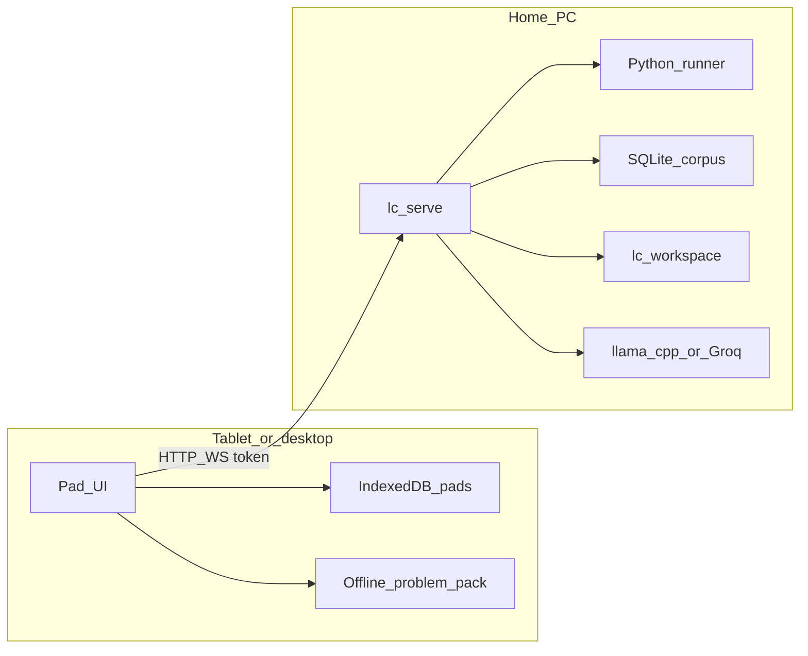
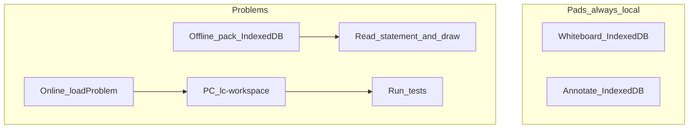

<p align="center">
  
</p>

# Whiteboard

A Rust CLI and terminal UI for practicing LeetCode-style problems from **local JSON corpora**. Index thousands of problems into SQLite, browse and filter them, generate Python workspaces, run tests, and ask an LLM tutor for hints — **without ever loading or sending reference solutions** from the dataset.

There is a second path: sketch the approach by hand on a tablet or desktop canvas while an agent watches, grills you, and points at the sample case your approach breaks on.

`5 problem sets` · `local or Groq` · `tablet or desktop` · `PolyForm Noncommercial`

---

## 0. Overview

| Surface | What it is |
| --- | --- |
| **CLI** | Index corpora, search, load workspaces, run tests, ask the tutor |
| **TUI** | Full-screen practice UI in the terminal (`lc` / `lc tui`) |
| **IDE** | Edit `solution.py` in Cursor or VS Code; optional LLM Autocorrect |
| **GUI** | Whiteboard app (`app/`) talking to `lc serve` over HTTP/WS |

```
JSON corpora ─whiteboard index──▶ SQLite (problems.db)
                              │
                        whiteboard load <id>
                              ▼
        ~/lc-workspace/[<dataset>/]<task_id>/
        ├── solution.py
        ├── board.json          ← whiteboard, when kept
        ├── run_tests.py
        └── .lc/meta.json       ← cases / entry point (no reference solution)
                              │
                        whiteboard test · whiteboard ask · lc serve → app/
```

The crate stays `whiteboard`; the CLI binary is `lc`. Config still lives under the OS project dir named `lc` (`lc config path`). Workspace and data defaults (`~/lc-workspace`, `~/lc-data`) and env vars (`GROQ_API_KEY`, `LC_LOCAL_API_KEY`, `OPENAI_API_KEY`) are unchanged.

---

## 1. Installation, dataset downloads, model config, and setup

**Needs:** Rust 1.75+, Python 3.10+, and for the whiteboard client Node 20+.

```bash
cargo install --path .
pip install -U huggingface_hub pyarrow

python scripts/fetch_dataset.py leetcode --data-dir ~/lc-data
# or: python scripts/fetch_dataset.py --all --data-dir ~/lc-data

whiteboard config set data-dir ~/lc-data
whiteboard index
lc                            # TUI
```

Client internals, Android sideload, and cleartext-HTTP notes → [`app/README.md`](app/README.md).

### Model config

Point `whiteboard` at any OpenAI-compatible endpoint (vLLM, llama.cpp, Ollama, LM Studio) or Groq:

```bash
whiteboard config set llm.provider local
whiteboard config set llm.local.base_url http://127.0.0.1:8000/v1
whiteboard config set llm.local.model qwen3-vl-8b
whiteboard config set llm.local.vision_model qwen3-vl-8b
```

API keys stay in the environment (`GROQ_API_KEY`, optional `LC_LOCAL_API_KEY`) — not in the TOML. Config path: `whiteboard config path`.

---

## 2. TUI usage

```bash
lc                  # or: lc tui
```

On the browse screen:

| Key | Action |
| --- | --- |
| **W / S** (↑ / ↓) | Move selection |
| **A / D** | Previous / next page |
| **/** | Search |
| **G** | Cycle problem set |
| **T** / **E** | Cycle tag / difficulty |
| **O** | Cycle sort |
| **Enter** | Actions (load workspace, open in editor, run tests, send to whiteboard, …) |
| **Q** | Quit |

Coach chat in the TUI can play structure traces as an **ASCII morph** between keyframes (see [License and references](#7-license-and-references)).

---

## 3. IDE usage

Generate a workspace, then open it in Cursor or VS Code:

```bash
whiteboard load two-sum --open
# or from the TUI action menu → open in editor
```

`whiteboard` looks for `cursor` then `code` on your PATH (`-r` reuses a window). You edit `solution.py`; tests stay local:

```bash
whiteboard test two-sum --verbose
whiteboard ask two-sum --case 3        # tutor never sees corpus solutions
```

Pairs well with **[LLM Autocorrect](https://github.com/amittenak47/LLM-AutoCorrect)**: `whiteboard` handles problem selection, workspaces, and testing; the extension fixes code as you type.

---

## 4. GUI usage

The canvas lives in [`app/`](app/). The corpus, workspaces, and Python runner stay on the PC behind `lc serve`.

```bash
lc serve --lan          # daemon (prints Host / Port / 6-digit Code)
cd app && npm install && npm run tauri dev
# Android APK: cd app && npm run android:apk
```

On desktop the app defaults to `http://127.0.0.1:7878` (no pairing). On a tablet, start with `--lan`, then enter **Host**, **Port**, and **Code** in the header.

**Review** — draw, tap **Submit**. Verdict, ratings, strengths, gaps, a Socratic question, and — when wrong — a counterexample citing a real sample case.

**Draw it** — diagram answer instead of prose (multi-frame traces share one scrubber).

**Reveal** — explicit, confirmed opt-in for a stepwise path from your approach; never a solution dump; logged in `whiteboard stats`.

**Lazy** — turns a justified board into `solution.py` (earned steps implemented, the rest stubbed).

The agent answers over the session WebSocket, so each stage of a review — reading
the board, naming your approach, checking it against the cases — shows up in the
chat as it happens rather than after. It also sticks to **one approach per
board**: several approaches are usually valid, and an agent that quietly switches
between them contradicts its own advice. A change of board that changes the
answer is announced, with a reason.

Two extras are off until you turn them on in **Settings → Agent**: a **planner**
(`llm.modes.planner`, point it at a frontier model) that catalogs the approach
families a problem admits before the local agent reads your board, and a
**drawn-diagram check** that looks at each rendered diagram and redraws it once
if the picture does not show what it claims.

How the agent works: redaction, diagrams as programs rather than pictures, the
approach commitment model, and the socket frame contract live under
`src/llm/coach/` (HTTP routes stay `/coach/*`).

Browser-over-LAN, spacedesk, and Android build details → [`app/README.md`](app/README.md).
Android pairing and Tailscale → [`app/docs/ANDROID_SETUP.md`](app/docs/ANDROID_SETUP.md).

---

## Where the work lives

Three layers. They move independently. **This branch keeps LeetCode tests on the home PC.** The tablet is a client; it never ran Python.

| Layer | What | Where (this branch) | “Anywhere” means |
| --- | --- | --- | --- |
| **Pad UI** | Canvas, ink, footnotes | Device (`app/`) | Already on the device |
| **Agent / LLM** | Chat HTTP | PC, via `lc serve` | The model URL must be reachable |
| **Daemon extras** | Corpus, `solution.py`, tests, document index | PC | Same machine as Python |

`lc serve` **is** the daemon. Putting “the server in the app” (the stripped branch below) compiles the **LLM client + prompts** into Tauri. It does not move Python onto Android.



### Problems vs pads vs offline pack



| Surface | Offline | Sync |
| --- | --- | --- |
| **Whiteboard / annotate** | Full. Working copy is IndexedDB on the device. | Dual-write to `lc serve` (`pads.db` + `pad-blobs/`). Tombstone hides a pad on every paired device; snapshots and PDF bytes stay on the PC. Pairing tokens stay per device. Sidecar `.lc-ink.json` is backup, not the sync path. |
| **Problems (online)** | Autosave parks the board in IndexedDB when the daemon is down. | Desktop, browser, and Android that pair to the **same** `lc serve` share `~/lc-workspace`. On reconnect, Personalise `offlineMerge` (ask / prefer-local / prefer-server) decides which board wins. |
| **Problems (offline pack)** | Settings can download statements (~100–250 MB). Browse and open a local board. **No** tests, **no** coach until `lc serve` is back. | Same merge pref as above once the daemon is reachable. |

Tests always call `python run_tests.py` on the PC (`src/workspace/runner.rs`). Coach Review (perceive → claim → verdict) always runs inside `lc serve`.

### Pad library vs pairing vs sidecar

The tablet IndexedDB is the working copy. `lc serve` is a redundant historical copy: a missing or corrupt local row must not delete the PC copy. Delete is hold-to-confirm and only tombstones the live list; restore from archive or from the 2h / 24h / 7d snapshots.

Personalise (handedness, theme, capture folder, …) is a **per-device** blob on the daemon. The first desktop session with no record clones the tablet (or any existing) blob once, then each device writes its own.

Pairing (`localStorage` `whiteboard.pairing`) is how *this* device authenticates. Do not copy tokens between devices.

Tailscale steps stay in [`app/docs/ANDROID_SETUP.md`](app/docs/ANDROID_SETUP.md) — install on PC and tablet, pair to the `100.x` IP, port 7878. No installer ships in this repo.

### Desktop, browser, Android

Same React client. Pairing is `baseUrl` + token (`app/src/api/pairing.ts`). Desktop defaults to `http://127.0.0.1:7878`. LAN or Tailscale: `http://<pc>:7878` plus the 6-digit code.

Android’s Tauri crate is a cleartext HTTP proxy, not an agent. The APK on this branch does not embed `lc serve`.

Cafe / campus: install Tailscale, pair to the PC’s `100.x` IP, port 7878. Encrypted mesh, no port-forward. Still tethered to the home Python and corpus — you are just off home Wi‑Fi.

### Fully untethered LeetCode (not this branch)

You can move one layer without the others. Doing **all** of them is a different product.

1. **LLM only** — Groq/OpenAI, or Tailscale to home llama.cpp. Main still needs `lc serve` for tests and the corpus.
2. **On-device Python** — Termux / a sidecar, not a typical Play-store APK. Fragile.
3. **Remote runner** — a VPS or microVM runs `run_tests.py`. That costs money. The free judge is the home PC.
4. **True offline LeetCode** — bundle the corpus and skip tests, or ship a runtime.

### Stripped branch (whiteboard + documents)

[`claude/strip-harness-ask-tauri-jeebbu`](https://github.com/amittenak47/lc-gui-tui/tree/claude/strip-harness-ask-tauri-jeebbu) is a **sibling product**, not a merge. No corpus, no Python runner, no problem browser.

Tauri depends on the crate with `default-features = false`: **agent in the APK**, no axum. Ask talks to `llm.local.base_url` from the device (Tailscale llama.cpp, or Groq). Browser builds still have no Tauri, so they still need a small daemon for Ask.

**Staged Review is gone there.** Ask is one model call. Draw/Viz still has a tool loop (diagrams), which is not perceive → claim → verdict.

Do not merge the two products. Main stays the harness.

---

## 5. Commands

| Command | Purpose |
| --- | --- |
| `lc` / `lc tui` | Interactive practice UI |
| `whiteboard index [--rebuild] [--dataset S]` | Build or refresh the SQLite index |
| `whiteboard datasets [--inspect]` | Problem sets and indexed counts; `--inspect` reports corpus columns |
| `whiteboard search` / `whiteboard random` | Filter or pick (`--dataset`, `--difficulty`, `--tag`, `-q`, `--sort`) |
| `whiteboard load <id> [--open] [--force]` | Generate a workspace; id = slug, question #, or prefix |
| `whiteboard test [id] [--case N] [--full] [-v]` | Run Python tests — exits `0` when every case passes |
| `whiteboard ask [id] [--case N] [--provider local\|groq]` | LLM debugging help |
| `lc serve [--port N] [--lan]` | Daemon for the whiteboard client |
| `whiteboard stats` · `whiteboard session reset` · `whiteboard list …` | Progress, session, named lists |
| `whiteboard config set/get/show/path` | Manage `config.toml` |

Coach modes are per-provider (`llm.modes.<ambient\|review\|bridge\|viz\|planner>`) and
the coach feature flags are `coach.<ws_runs\|process_events_ui\|approach_commitment\|planner_enabled\|draw_review_enabled>`. Those TOML keys are unchanged.

---

## 6. Datasets

| Slug | Hugging Face | What you get |
| --- | --- | --- |
| `leetcode` *(default)* | [newfacade/LeetCodeDataset](https://huggingface.co/datasets/newfacade/LeetCodeDataset) | ~2.9k Python LeetCode problems |
| `kodcode` | [KodCode/KodCode-V1](https://huggingface.co/datasets/KodCode/KodCode-V1) | Large synthetic set — `whiteboard` indexes **Complete** style only |
| `ms-python-q` | [morganstanley/sft-python-q-problems](https://huggingface.co/datasets/morganstanley/sft-python-q-problems) | Structured `test_cases` |
| `deepseek-leetcode` | [davidheineman/deepseek-leetcode](https://huggingface.co/datasets/davidheineman/deepseek-leetcode) | DeepSeek contest benchmark |
| `leetcode-with-tests` | [kr4t0n/leetcode-with-tests](https://huggingface.co/datasets/kr4t0n/leetcode-with-tests) | Community pack with pytest-style checks |

```bash
python scripts/fetch_dataset.py <slug> --data-dir ~/lc-data
whiteboard index --dataset <slug>
```

Adapters: [`src/datasets/`](src/datasets/). After adapter changes: `whiteboard index --dataset <slug> --rebuild`.

---

## Upcoming changes

- Desktop scrolling page indicator
- Chat improvements
- Optional corpus bundle / hosted dataset (see [Where the work lives](#where-the-work-lives) — LeetCode tests stay on the home PC on this branch)

---

## 7. License and references

[PolyForm Noncommercial 1.0.0](https://polyformproject.org/licenses/noncommercial/1.0.0) — free for personal, educational, and other noncommercial use; commercial use needs a separate license. See [LICENSE](LICENSE).

Problem corpus licensing is separate and differs per dataset: [LeetCodeDataset](https://huggingface.co/datasets/newfacade/LeetCodeDataset) is Apache 2.0; [KodCode-V1](https://huggingface.co/datasets/KodCode/KodCode-V1) is CC BY-NC 4.0 (non-commercial).

Release notes: [CHANGELOG.md](CHANGELOG.md).

### References

- [ascii-morph](https://github.com/tholman/ascii-morph) (Tim Holman) — dissolve morph between ASCII stills; the TUI coach viz player is a Rust/ratatui take on that idea (`src/tui/ascii_morph.rs`)
- [LLM Autocorrect](https://github.com/amittenak47/LLM-AutoCorrect) — editor companion for fixing code as you type
